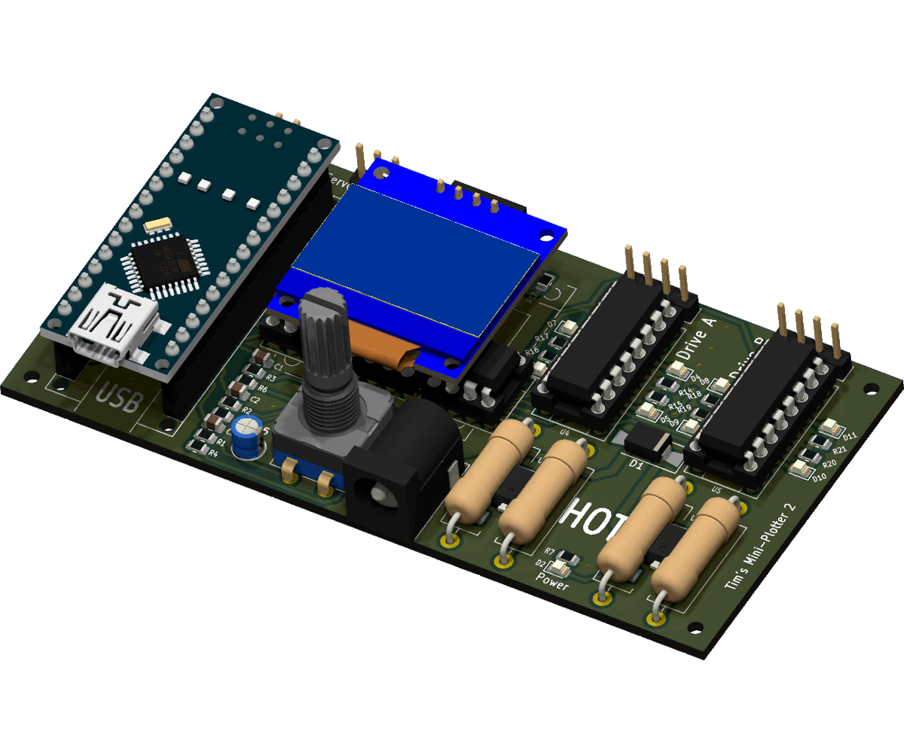
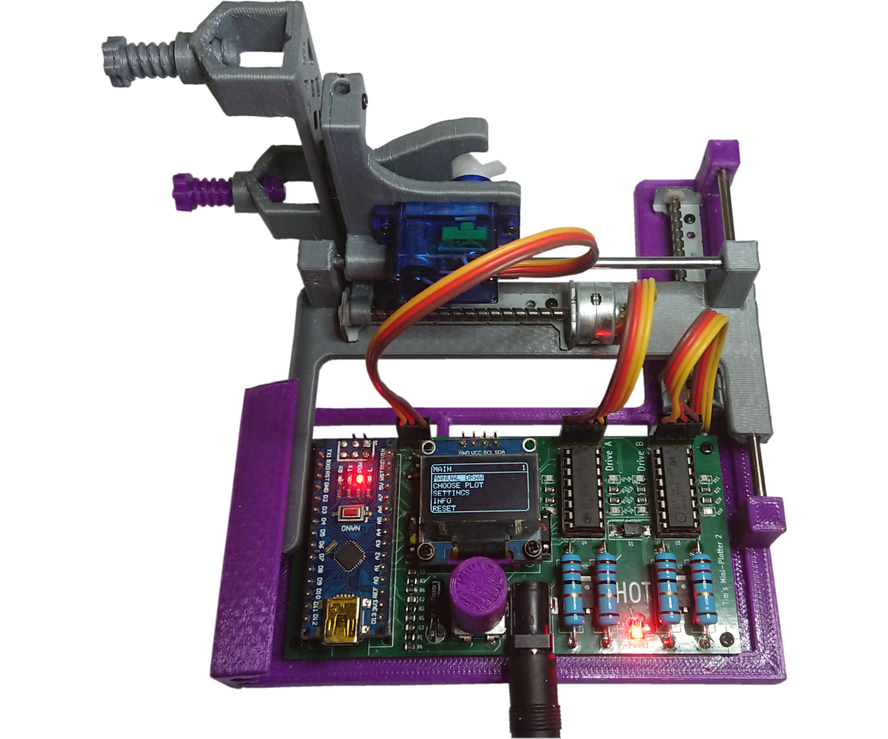
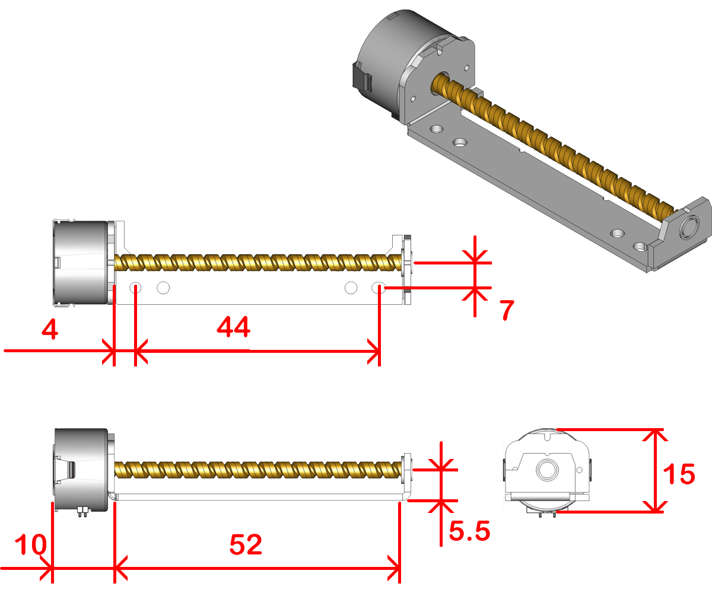
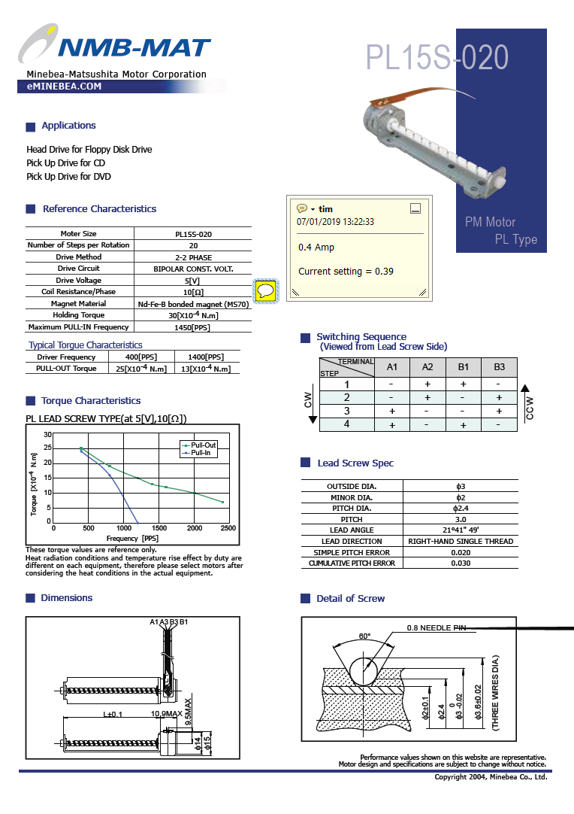
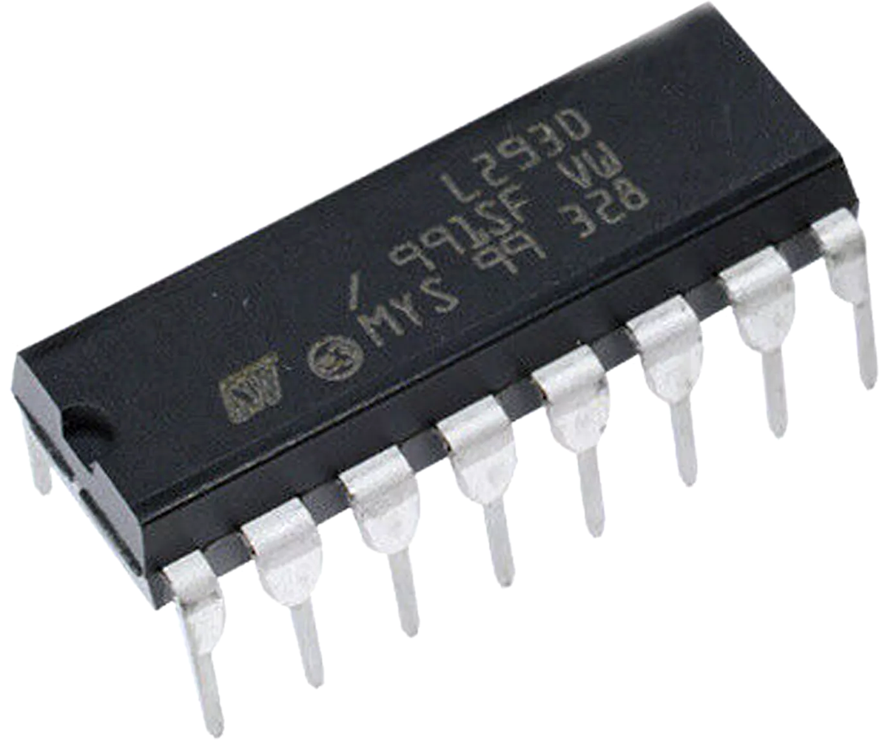
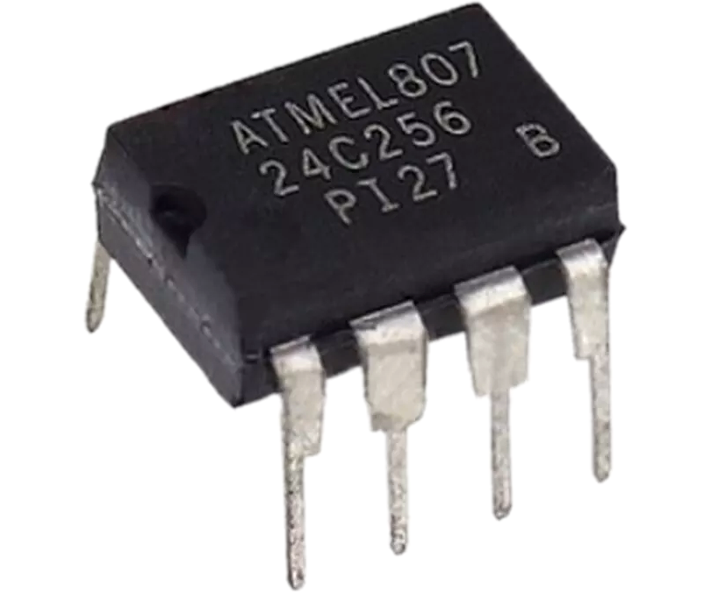
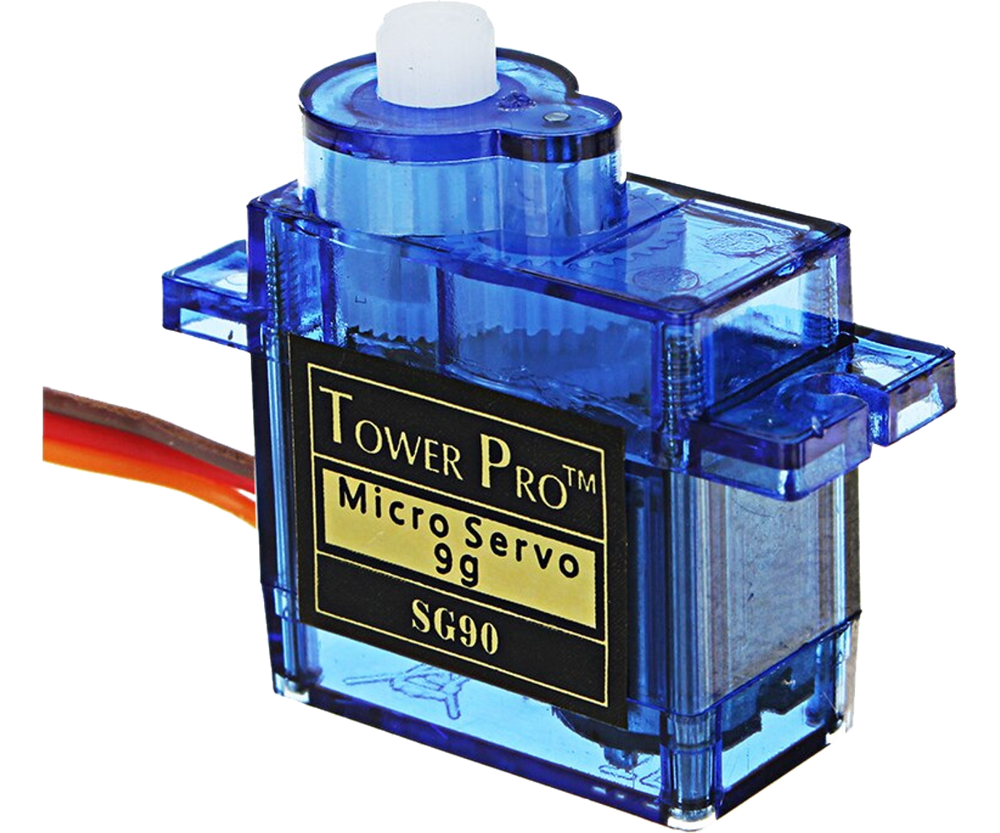
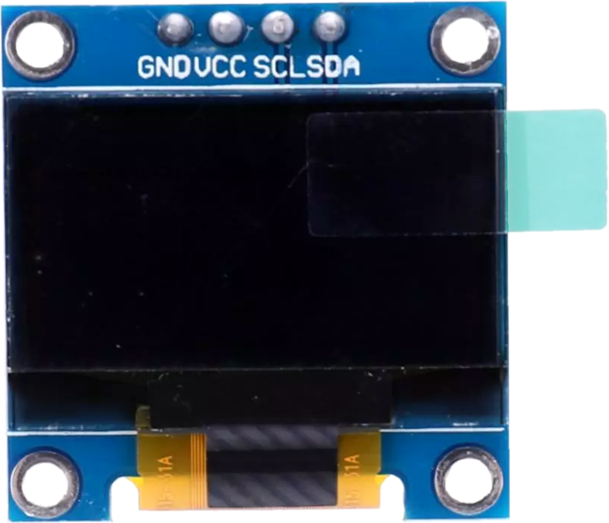

# This is My Mini Plotter 2 with a Single PCB  
  
## This is a Board to control two basic bipolar stepper motors.  
  
## *The Board fitted to the Mini Plotter.*  
### Files for [KiCAD EDA](https://www.kicad.org/)  
There is [**"Mini Plotter 2 Full.kicad_pcb.zip"**](bom/) file  
* This can be used when **"Plot Files"** asked for at 
 
when ordering 10 PCBs for $5  
* If you have **[KiCAD EDA](https://www.kicad.org/)**,  

have a Plugin  that will make things simple to order a PCB,  
just load this project into **[KiCAD EDA](https://www.kicad.org/)** install the plugin click the Icon  and it will create all the nesesery files needed and take you to order a PCB 
and compeate the form on 
 
web site.  
  

### Files for [3D Printing](https://www.pcbway.com/rapid-prototyping/manufacture/?type=2&reffercode=TOP)  
There is [a folder with all the STL files needed](STL/) to print the Mini Plotter.

## Note!
The BOM only contains the Components for the Board.  
Other Parts required are:  
* Arduino Nano Module.
* 2 Stepper Motor 15mm dia. x 50mm Screw. (The type from CD or DVD drive)
* SG90 Servo.
* 3 lengths of 3mm Linear Rod.
* A light Spring 3mm x 25mm.
* 11 M1.7 x 6mm self tap flat nose screws.
* The 3D printed parts.
## About  
This is a PCBWay PCB Version of mini plotter I did quit a while ago, my original mini plotter I made of standard modules I bought and a home made PCB.

Details of the original can be found at my Blog here: [Tim's Mini Plotter 2 (tims-mini-plotter2.blogspot.com)](https://tims-mini-plotter2.blogspot.com/2019/01/tims-mini-plotter-2-this-is-new-project.html)

So it is the PCBWay PCB version.  
PCBWay do a great offer in prototyping PCBs, so I decided to make a version based around a single PCB.  
This is the same as the original except for the electronics, it has been made slightly longer to accommodate a single PCB.
## My Brief
For this project, I wanted to make a compact portable plotter using 2 motors from CD/DVD Drives.  
I wanted to use the cheap L298 drivers.  
I wanted to give it some memory where it can store some plots, and have a menu system to set some basic settings and be able to chose plots stored in memory.
## What I use
I use [FreeCAD](https://www.freecad.org/)  to design my 3D Prints, and [KiCAD EDA](https://www.kicad.org/) to design my PCB.  
Both these programs can integrate with each other. They are open source and I recommend them.  
[KiCAD EDA](https://www.kicad.org/) also has a plugin  from  that makes it simple to order PCBs.
## History
My previous Mini Plotter Ver. 1 looked like this: [Version 1](https://tims-mini-plotter-1.blogspot.com/) [Version 1.3](https://www.youtube.com/watch?v=I_yTPbJcGrc&feature=youtu.be)
### Here is is a video of the original Mini Plotter 2 to show how it works.
*Click this image to see a video of it in use.*

This new version works exactly in the same way.
## Stepper Motors
  
The stepper motors I am using for this project are motors I repurposed from some CD/DVD drives.  
The dimensions are approximate, I have put holes to suit what I have shown.  
Care should be taken when soldering new cables to these motors, it is very easy to melt the coil bobbins.  
The only data I could find for these type of motors was from a data sheet for a PL15S-020. (I will assume other makes are similar)  
  
If we do a little maths: V=ri, 5 volt divided by 10 ohms = 0.5 Amps  
As I could check the resistance of my motors and found them to have 12 ohm resistance.  
I will work on the assumption mine require 0.4A. (5/12=0.42A)  
They probably are designed to take 0.5A, but: they are normally mounted to a large metal frame that acts like a massive heat sink.  
My steppers are going to be mounted to plastic. (PLA)  
Knowing this I will be wiring the Voltage regulators in the Constant Current configuration. (see L78xx family data sheets)  
I had some 12.5 ohm 2 Watt Resistors, so I have 2 for each drive.  
12.5 ohm 2 Watt two in parallel making 6.25 ohm.  
## Motor Driver
I have used two L293 drivers to drive the stepper motors.  
  
## Memory
I have used two 24C256 I2C Memory Chips, there is room for three.  
  
To program the memory you will need the Application I wrote and some Arduino code.  
I have gone into detail of how I compress G-Code command lines to 3 bytes on my blog here: [Adding Memory to Arduino NANO and compressing G-Code (tims-mini-plotter2.blogspot.com)](https://tims-mini-plotter2.blogspot.com/2019/04/adding-memory-to-arduino-nano-and.html)  
## Servo
The servo is any SG90.  
  
The horn I used had two long and two short arms.  
## Display
The display is an I2C 0.9 inch OLED  
  
## Power
I have added the L7805 to power the servo or a laser.  
Any 5v auxiliary device can be attached to this switched output.  
The Arduino Nano has its own Linear regulator, this regulator limits the input voltage to 12v. (I should have wired it differently)  
The plotter runs best above 10 Volts.  
## Assembly Of the Plotter.
Assembly is the same as I did with the original here: [Tim's Mini Plotter 2: Assembly (tims-mini-plotter2.blogspot.com)](https://tims-mini-plotter2.blogspot.com/2019/03/assembly.html)  
The only difference is the parts use.  
* There is a [folder of Images ](Assembly_Images/) that show how these parts go to gether.  
* As I mentioned, this is modified to take the new Single PCB by .  
* Please read some of the original Blog, There are things that need attention. The Screw Pad, The Linear Rod Fit.
I have also done an Instructable of the new version.
[Tim's Mini Plotter 2 With Single PCB](https://www.instructables.com/Tims-Mini-Plotter-2-With-Single-PCB/)  
## I did some Live Streams should you want to make this.
These are the sort of stream you click through to find the info you want.  
Treat them like a reference book. :)    
[Tim Live Part 1 of Mini Plotter (youtube.com)](https://www.youtube.com/watch?v=YSE00Mr2BqY)  
[Tim Live Part 2 of Mini Plotter (youtube.com)](https://www.youtube.com/watch?v=kGypXZ9P3tI&t=1s)  
[Tim Live Part 3 of Mini Plotter (youtube.com)](https://www.youtube.com/watch?v=wI7Unksa26g&t=3s)  
